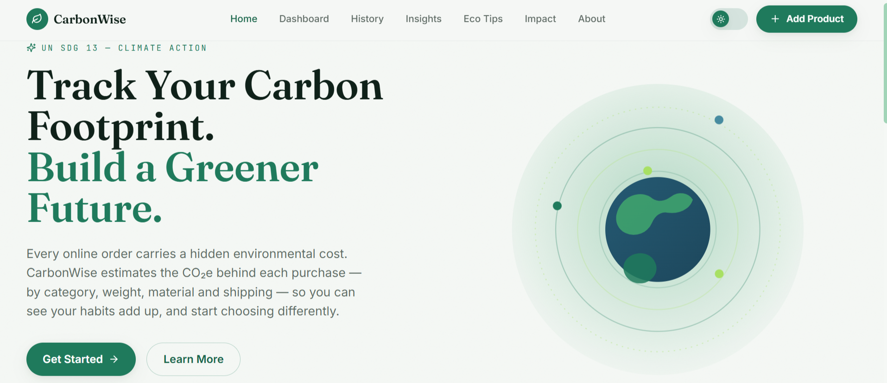
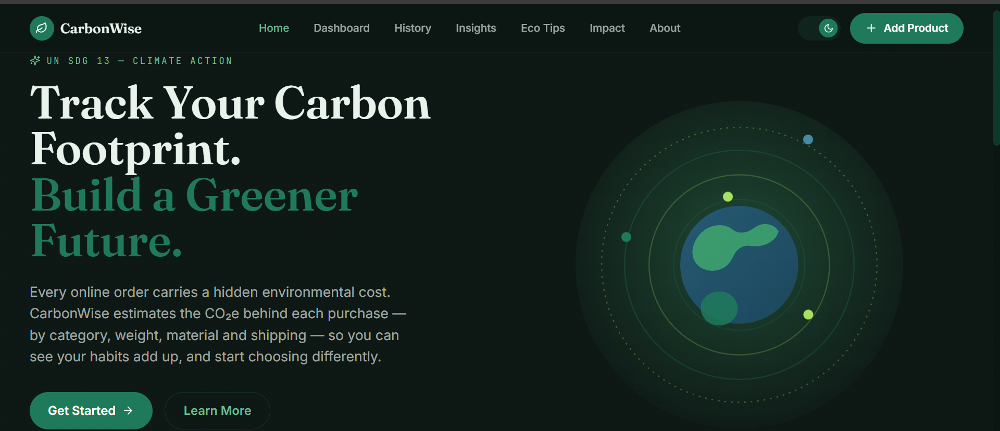
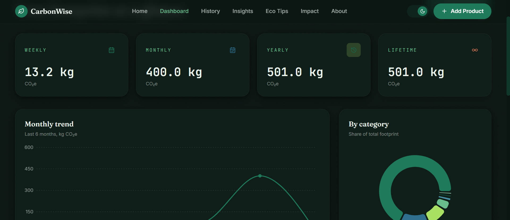
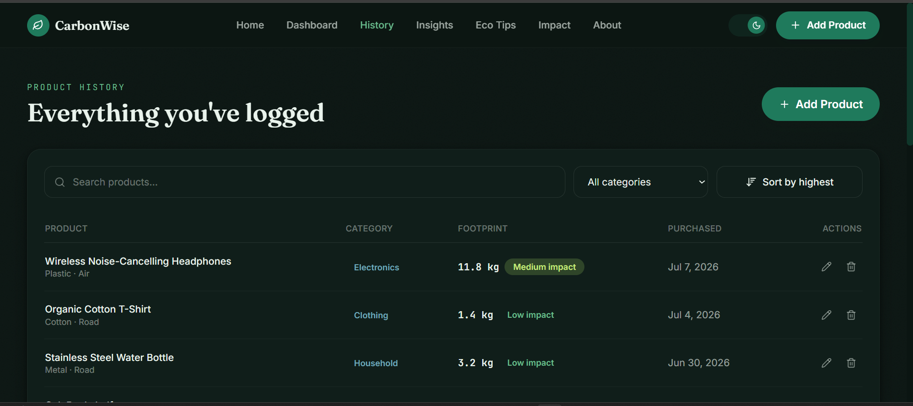

# CarbonWise — Personal Carbon Footprint Tracker

A capstone project in support of **UN SDG 13 — Climate Action**. CarbonWise estimates the carbon
footprint of the products you buy online — using category, weight, material, and shipping
assumptions — so you can see your habits add up over time and shop more consciously.

> Estimates are educational, not a certified life-cycle assessment.

## Preview

<p align="center">
  
  
</p>


## 🚀 Live Demo
**🌐 https://carbonwise-beta.vercel.app/**

**Try CarbonWise instantly — no installation required.**

A capstone project in support of **UN SDG 13 — Climate Action**...

## Tech stack

- React 18 + Vite
- Tailwind CSS (custom forest / slate-teal / lime design system)
- React Router
- Framer Motion
- Recharts
- Lucide React icons
- Browser `localStorage` for persistence — no backend required

## Getting started

```bash
npm install
npm run dev
```

Then open the URL Vite prints (usually `http://localhost:5173`).

To build for production:

```bash
npm run build
npm run preview
```

## Pages

| Route | Description |
|---|---|
| `/` | Landing page with hero and product overview |
| `/about` | What a carbon footprint is, SDG 13, and how the app helps |
| `/dashboard` | Weekly / monthly / yearly / lifetime summary cards + charts |
| `/add-product` | Form to log a new product and estimate its footprint |
| `/history` | Searchable, filterable, sortable product table with edit/delete |
| `/insights` | Highest/lowest emitters, averages, trends, achievement badges |
| `/eco-tips` | Practical sustainability tips |
| `/impact` | Real-world equivalents (driving distance, electricity days, trees) |

## Data & estimation model

All product data lives in the browser's `localStorage` under the key `carbonwise-products` —
nothing is sent to a server. On first run the app seeds a handful of demo products so the
dashboard isn't empty; add your own and edit or delete the demo entries at any time from the
History page.

The footprint estimate (`src/utils/carbonCalculator.js`) combines:

- a manufacturing factor per **category** (kg CO2e per kg of product)
- a multiplier per **material**
- a shipping factor per **km** that depends on **shipping method** (road / rail / sea / air)

This is intentionally simple and transparent — the goal is to make relative comparisons
between purchases, not to match a certified life-cycle assessment.

## Dashboard & Footprint History Preview

<p align="center">
  
  
</p>


## Project structure

```
src/
  components/
    layout/      Navbar, Footer, PageWrapper
    ui/           Buttons, cards, toasts, dialogs, progress rings, theme toggle…
    dashboard/    Summary cards + charts
    products/     Add/edit form, history table
    insights/     Insight stat cards
    ecotips/      Tip cards
    impact/       Impact comparison cards
    badges/       Achievement badge display
  context/        ThemeContext (dark/light), DataContext (products, toasts)
  hooks/          useLocalStorage
  pages/          One file per route
  utils/          Carbon calculator, stats, equivalents, formatters, dummy data, achievements
```

## Notes for grading / demo

- Dark/light mode toggle persists across sessions.
- Deleting a product asks for confirmation first.
- Achievement badges unlock automatically as you log products (see `utils/achievements.js`).
- All charts and summary numbers update live — no page refresh needed.
